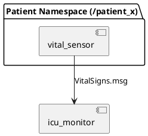

# ICU 複数患者 VitalSigns 監視（ROS 2 Humble / colcon workspace）

複数患者（例: `patient_01`, `patient_02`）のバイタルを **namespace で分離**して publish し、集約ノードが患者ごとのトピックを subscribe して一覧表示します。

## 目的と設計思想
このリポジトリは、ROS 2 Humble 上で「複数患者のバイタル監視」を題材に、**再現可能な colcon workspace** としての構成・運用（起動/停止/確認）をまとめた学習用サンプルです。

- **型安全メッセージ**: 独自 msg（`medical_interfaces/VitalSigns.msg`）でバイタルデータを型として定義し、ノード間通信を明確化します。
- **namespace 分離**: 患者ごとに namespace を切って同一ノードを複数起動し、トピック衝突を避けながらスケールさせます。
- **clean shutdown 設計**: `Ctrl+C` で確実に落ちることを前提に、launch 側の猶予設定と node 側の終了処理を整えています。

構成（処理の流れ）は次のとおりです。

## アーキテクチャ図（概要）



- `vital_sensor` が相対トピック `patient_vitals` に publish（例: `/patient_01/patient_vitals`）
- `icu_monitor` が `patients` 引数から購読先 `/{pid}/patient_vitals` を決定

Day3 の shutdown / clean exit の学びは [docs/day3_shutdown_clean_exit.md](docs/day3_shutdown_clean_exit.md) にまとめています。

## 前提（ROS 2 Humble）
- ROS 2 Humble がインストール済み
- `colcon` が利用できる

例（Ubuntu 想定）:
```bash
sudo apt update
sudo apt install -y python3-colcon-common-extensions python3-rosdep
```

## 依存（rosdep）
この workspace には 2 パッケージがあります。

- `medical_interfaces`（`VitalSigns.msg`）
- `medical_robot_sim`（`vital_sensor`, `icu_monitor`）

依存解決（初回のみ `rosdep update`）:
```bash
cd ~/ros2_ws
source /opt/ros/humble/setup.bash

rosdep update
rosdep install --from-paths src --ignore-src -r -y
```

## ビルド
```bash
cd ~/ros2_ws
source /opt/ros/humble/setup.bash
colcon build --symlink-install
```

## 起動
### 環境読み込み
```bash
source /opt/ros/humble/setup.bash
source ~/ros2_ws/install/setup.bash
```

### マルチ患者起動（デフォルト: `patient_01`〜`patient_05`）
```bash
cd ~/ros2_ws
ros2 launch medical_robot_sim icu_multi_patient.launch.py
```

### launch 引数 `patients:=...` の説明
`patients` は **CSV（カンマ区切り）**で、各要素が患者 namespace になります。

- 例: `patients:=patient_01,patient_02`
  - `vital_sensor` が 2 個起動し、それぞれ `/patient_01/patient_vitals`, `/patient_02/patient_vitals` に publish
  - `icu_monitor` は 1 個だけ起動し、両方を subscribe

患者を 2 人に絞る例:
```bash
cd ~/ros2_ws
ros2 launch medical_robot_sim icu_multi_patient.launch.py patients:=patient_01,patient_02
```

引数一覧の確認:
```bash
cd ~/ros2_ws
ros2 launch medical_robot_sim icu_multi_patient.launch.py --show-args
```

## 停止
通常は `Ctrl+C` で停止します。

停止まわりの学び（shutdown / clean exit）: [docs/day3_shutdown_clean_exit.md](docs/day3_shutdown_clean_exit.md)

もし特定患者の `vital_sensor` だけ止めたい場合（Fault injection / 動作確認用）:
```bash
# __ns:=/patient_02 が目印
pgrep -af vital_sensor | grep "__ns:=/patient_02"

# 先頭の数値(PID)を kill
kill <PID>
```

## 確認コマンド（topic echo / hz）
（別ターミナルの場合は、先に環境を読み込みます）

```bash
source /opt/ros/humble/setup.bash
source ~/ros2_ws/install/setup.bash
```

### トピック一覧
```bash
ros2 topic list | grep patient_vitals
```

### 1 件だけ表示
```bash
ros2 topic echo /patient_01/patient_vitals --once
```

### publish レート確認
```bash
ros2 topic hz /patient_01/patient_vitals
```

## 再現の合格条件
このリポジトリの「再現できた」と判断する最小条件は次のとおりです。

- `ros2 launch medical_robot_sim icu_multi_patient.launch.py` が起動し、`icu_monitor` が患者一覧を 1 秒ごとに更新表示する
- `ros2 topic echo /patient_01/patient_vitals --once` が 1 件出力する（型が `medical_interfaces/msg/VitalSigns`）
- `ros2 topic hz /patient_01/patient_vitals` が 0Hz ではなく、おおむね 1Hz 前後のレートを示す
- rosbag 記録後に `ros2 bag info <bag_dir>` で、対象トピックが表示される

### `ros2 topic echo` 期待出力例（最小）
```text
patient_id: patient_01
measurement_id: 0
heart_rate: 72
blood_pressure_systolic: 120
blood_pressure_diastolic: 80
body_temperature: 36.5
oxygen_saturation: 98
status: monitoring
```

### `ros2 topic hz` 期待出力例（最小）
```text
average rate: 1.0
```

### `ros2 bag info` 期待出力例（最小）
```text
Storage id: sqlite3
Duration: 5.0s
Messages:
  Topic: /patient_01/patient_vitals | Type: medical_interfaces/msg/VitalSigns | Count: 5
  Topic: /patient_02/patient_vitals | Type: medical_interfaces/msg/VitalSigns | Count: 5
```

## rosbag 記録/再生
ICU の検証用に、患者ごとの `VitalSigns` を rosbag に記録・再生できます。

（別ターミナルの場合は、先に環境を読み込みます）
```bash
source /opt/ros/humble/setup.bash
source ~/ros2_ws/install/setup.bash
```

### 記録（デフォルト: patient_01〜patient_05）
```bash
cd ~/ros2_ws
./src/medical_robot_sim/scripts/rosbag_record_vitals.sh
```

患者を 2 人に絞る例（CSV）:
```bash
cd ~/ros2_ws
./src/medical_robot_sim/scripts/rosbag_record_vitals.sh patient_01,patient_02
```

### 再生
直近の `bags/*` を自動選択して再生:
```bash
cd ~/ros2_ws
./src/medical_robot_sim/scripts/rosbag_play_vitals.sh
```

bag を明示する例:
```bash
cd ~/ros2_ws
./src/medical_robot_sim/scripts/rosbag_play_vitals.sh bags/vitals_YYYYmmdd_HHMMSS
```

（任意）接続関係確認:
```bash
sudo apt update
sudo apt install -y ros-humble-rqt-graph
rqt_graph
```

## 想定出力例（1段）
`icu_monitor` は 1 秒ごとにダッシュボード表示を更新します（launch 経由だとクリア上書きできず、ブロック表示になる場合があります）。

```text
ICU DASHBOARD  (patients=2)
----------------------------------------------------------------------------------------------------
pid        | alert   |  HR | SpO2 | BP      | Temp | note               | age
----------------------------------------------------------------------------------------------------
patient_01 | OK      |  72 |   96 | 129/83  | 37.0 | -                  |  0s
patient_02 | OK      |  73 |   96 | 118/74  | 37.3 | -                  |  0s
----------------------------------------------------------------------------------------------------
```
