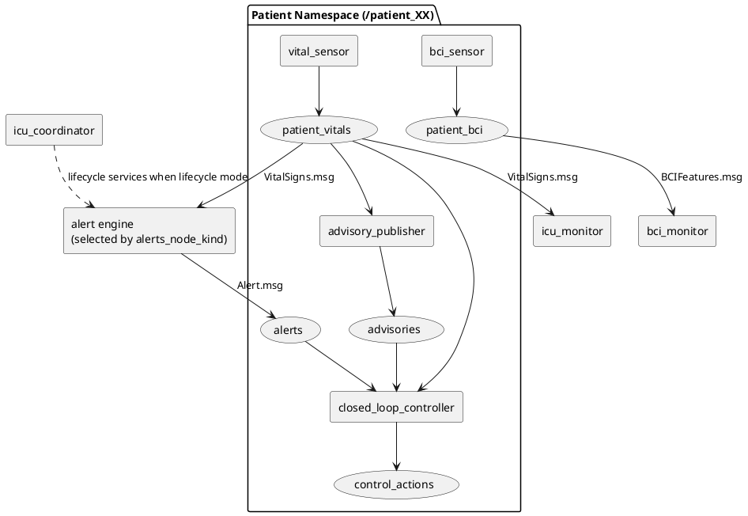

# ROS 2 Medical Physical AI Lab（ROS 2 Humble / colcon workspace）

[](https://github.com/tukino/ros2-medical-physical-ai/actions/workflows/ci.yml)

複数患者（例: `patient_01`, `patient_02`）のバイタルを **namespace で分離**して publish し、
監視・アラート・助言・協調・閉ループ制御までをROS 2上で段階的に学ぶための実験用リポジトリです。

## 目的と設計思想
このリポジトリは、ROS 2 Humble 上で「複数患者のバイタル監視」を題材に、
**センサー → 分散処理 → 判断 → アクション** までを一貫して扱えるようになることを目的にした
再現可能な colcon workspace です。

- **型安全メッセージ**: 独自 msg（`src/medical_interfaces/msg/VitalSigns.msg` など）でバイタルデータやアラートを型として定義し、ノード間通信を明確化します。
- **namespace 分離**: 患者ごとに namespace を切って同一ノードを複数起動し、トピック衝突を避けながらスケールさせます。
- **疎結合な機能追加**: alerts / advisories / control actions を topic と launch 引数で追加し、既存の topic 契約を維持します。
- **再現性重視**: fault injection、grep可能なイベントログ、rosbag replay、pytest を組み合わせて、同じ条件で検証できる状態を保ちます。
- **clean shutdown 設計**: `Ctrl+C` で確実に落ちることを前提に、launch 側の猶予設定と node 側の終了処理を整えています。

> [!IMPORTANT]
> このリポジトリはROS 2学習・研究・デモ用です。医療機器、診断、治療、実患者監視での利用を目的としたものではありません。

## 現在の到達点

初期の「複数患者のVitalSigns監視」から、現在は次の範囲まで拡張しています。

| 領域 | 実装内容 |
| --- | --- |
| 基本通信 | `VitalSigns.msg` / `Alert.msg` / `BCIFeatures.msg` による型付きtopic通信 |
| スケール | 患者ごとのnamespace分離とmulti-patient launch |
| 監視・異常検知 | dashboard表示、rule-based alerts、flatline検知、YAMLルール外部化 |
| システム設計 | QoS明示化、Lifecycle Node、Fault Injection、Logging/Tracing |
| 再現性 | rosbag record/play、replay専用launch、acceptance手順 |
| Physical化 | 実センサーI2C/SPIのmock/抽象化、Jetson/edge向け設計メモ |
| 応用 | EEG/BCI入力、advisory layer、multi-node coordination、closed-loop control |
| 統合検証 | rosbag replay × 閉ループ制御の一貫したCI自動化（Day19） |

構成（処理の流れ）は次のとおりです。

## アーキテクチャ図（現在）


```plantuml
@startuml
skinparam componentStyle rectangle

package "Patient Namespace (/patient_XX)" {
  [vital_sensor]
  [bci_sensor]
  [advisory_publisher]
  [closed_loop_controller]

  [vital_sensor] --> (patient_vitals)
  [bci_sensor] --> (patient_bci)
  (patient_vitals) --> [advisory_publisher]
  (patient_vitals) --> [closed_loop_controller]
  (alerts) --> [closed_loop_controller]
  (advisories) --> [closed_loop_controller]
  [advisory_publisher] --> (advisories)
  [closed_loop_controller] --> (control_actions)
}

[icu_monitor]
[bci_monitor]
[alert engine\n(selected by alerts_node_kind)] as alert_engine
[icu_coordinator]

(patient_vitals) --> [icu_monitor] : VitalSigns.msg
(patient_bci) --> [bci_monitor] : BCIFeatures.msg
(patient_vitals) --> alert_engine : VitalSigns.msg
alert_engine --> (alerts) : Alert.msg
[icu_coordinator] ..> alert_engine : lifecycle services when lifecycle mode
@enduml
```

- `vital_sensor` が相対トピック `patient_vitals` に publish（例: `/patient_01/patient_vitals`）
- `icu_monitor` が `patients` 引数から購読先 `/{pid}/patient_vitals` を決定
- `bci_sensor` が相対トピック `patient_bci` に publish し、`bci_monitor` が `/{pid}/patient_bci` を購読
- alert engine は `alerts_node_kind:=classic|lifecycle` で classic 実装または Lifecycle 実装のどちらか一方を起動し、どちらもノード名 `rule_alert_engine` として `/{pid}/alerts` を publish
- `advisory_publisher` が `/{pid}/advisories` を追加topicとして publish
- `closed_loop_controller` が vitals / alerts / advisories から `/{pid}/control_actions` を publish
- `icu_coordinator` がLifecycleモードの `rule_alert_engine` の状態遷移を制御

Day3 の shutdown / clean exit の学びは [docs/day3_shutdown_clean_exit.md](docs/day3_shutdown_clean_exit.md) にまとめています。

## 代表デモ

### 1. 基本の複数患者監視

```bash
cd ~/ros2_ws
source /opt/ros/humble/setup.bash
colcon build --symlink-install
source install/setup.bash

ros2 launch medical_robot_sim icu_multi_patient.launch.py \
  patients:=patient_01,patient_02
```

### 2. Fault Injection + alert観測

```bash
ros2 launch medical_robot_sim icu_multi_patient.launch.py \
  patients:=patient_01 \
  enable_alerts:=true \
  scenario:=flatline
```

別ターミナル:

```bash
ros2 topic echo /patient_01/alerts --once
```

### 3. rosbag replayで再現検証

```bash
ros2 launch medical_robot_sim icu_replay.launch.py \
  patients:=patient_01 \
  enable_alerts:=true

# 別プロセスで記録済みbagを再生
ros2 bag play <bag_dir>
```

### 4. 閉ループ制御の最小デモ

```bash
ros2 launch medical_robot_sim icu_multi_patient.launch.py \
  patients:=patient_01 \
  enable_alerts:=true \
  enable_closed_loop:=true \
  scenario:=spo2_drop
```

確認:

```bash
ros2 topic echo /patient_01/control_actions --once
```

## ドキュメント（Roadmap / 詳細）

このリポジトリは「Dayごとの設計メモ」を docs/ 配下に蓄積していきます。README は最短で動かすための入口に留め、詳細は docs を参照してください。

- 全体計画（Master Plan）: [docs/PLAN.md](docs/PLAN.md)
- Day6 flatline: [docs/day6_flatline.md](docs/day6_flatline.md)
- Day7 ルール外部化（YAML）: [docs/day7_rule_externalization.md](docs/day7_rule_externalization.md)
- Day8 QoS: [docs/day8_qos.md](docs/day8_qos.md)
- Day9 Lifecycle: [docs/day9_lifecycle.md](docs/day9_lifecycle.md)
- Day10 Fault Injection: [docs/day10_fault_injection.md](docs/day10_fault_injection.md)
- Day11 Logging/Tracing: [docs/day11_logging_tracing.md](docs/day11_logging_tracing.md)
- Day12 rosbag再現性: [docs/day12_rosbag_reproducibility.md](docs/day12_rosbag_reproducibility.md)
  - 受け入れ（コピペ手順）: [specs/day12_rosbag_reproducibility/acceptance.md](specs/day12_rosbag_reproducibility/acceptance.md)
- Day13 実センサー接続（I2C/SPI）: [docs/day13_real_sensor_i2c_spi.md](docs/day13_real_sensor_i2c_spi.md)
  - 受け入れ（コピペ手順）: [specs/day13_real_sensor_i2c_spi/acceptance.md](specs/day13_real_sensor_i2c_spi/acceptance.md)
- Day14 Edgeデバイス（Jetson）: [docs/day14_jetson.md](docs/day14_jetson.md)
  - 受け入れ（コピペ手順）: [specs/day14_jetson/acceptance.md](specs/day14_jetson/acceptance.md)
- Day15 EEG/BCI入力: [docs/day15_eeg_bci_input.md](docs/day15_eeg_bci_input.md)
  - 受け入れ（コピペ手順）: [specs/day15_eeg_bci_input/acceptance.md](specs/day15_eeg_bci_input/acceptance.md)
- Day16 異常検知AI（advisory layer）: [docs/day16_anomaly_detection_ai.md](docs/day16_anomaly_detection_ai.md)
  - 受け入れ（コピペ手順）: [specs/day16_anomaly_detection_ai/acceptance.md](specs/day16_anomaly_detection_ai/acceptance.md)
- Day17 マルチノード協調: [docs/day17_multi_node_coordination.md](docs/day17_multi_node_coordination.md)
  - 受け入れ（コピペ手順）: [specs/day17_multi_node_coordination/acceptance.md](specs/day17_multi_node_coordination/acceptance.md)
- Day18 リアルタイム制御（閉ループ）: [docs/day18_realtime_closed_loop.md](docs/day18_realtime_closed_loop.md)
  - 受け入れ（コピペ手順）: [specs/day18_realtime_closed_loop/acceptance.md](specs/day18_realtime_closed_loop/acceptance.md)
- Day19 rosbag replay × 閉ループ制御統合検証: [docs/day19_rosbag_replay_closed_loop.md](docs/day19_rosbag_replay_closed_loop.md)
  - 受け入れ（コピペ手順）: [specs/day19_rosbag_replay_closed_loop/acceptance.md](specs/day19_rosbag_replay_closed_loop/acceptance.md)

## 前提（ROS 2 Humble）
- ROS 2 Humble がインストール済み
- `colcon` が利用できる

例（Ubuntu 想定）:
```bash
sudo apt update
sudo apt install -y python3-colcon-common-extensions python3-rosdep
```

## 依存（rosdep）
この workspace には 2 パッケージがあります。

- `medical_interfaces`（`msg/VitalSigns.msg`, `msg/Alert.msg`, `msg/BCIFeatures.msg`）
- `medical_robot_sim`（`vital_sensor`, `icu_monitor`, `rule_alert_engine`, `advisory_publisher`, `icu_coordinator`, `closed_loop_controller` など）

依存解決（初回のみ `rosdep update`）:
```bash
cd ~/ros2_ws
source /opt/ros/humble/setup.bash

rosdep update
rosdep install --from-paths src --ignore-src -r -y
```

## ビルド
```bash
cd ~/ros2_ws
source /opt/ros/humble/setup.bash
colcon build --symlink-install
```

## 起動
### 環境読み込み
```bash
source /opt/ros/humble/setup.bash
source ~/ros2_ws/install/setup.bash
```

### マルチ患者起動（デフォルト: `patient_01`〜`patient_05`）
```bash
cd ~/ros2_ws
ros2 launch medical_robot_sim icu_multi_patient.launch.py
```

### BCI入力（Day15 / 単一患者）
```bash
cd ~/ros2_ws
ros2 launch medical_robot_sim icu_bci.launch.py patient:=patient_01 driver:=mock
```

引数や受け入れ（コピペ手順）は Day15 にまとめています: [docs/day15_eeg_bci_input.md](docs/day15_eeg_bci_input.md)

### launch 引数 `patients:=...` の説明
`patients` は **CSV（カンマ区切り）**で、各要素が患者 namespace になります。

- 例: `patients:=patient_01,patient_02`
  - `vital_sensor` が 2 個起動し、それぞれ `/patient_01/patient_vitals`, `/patient_02/patient_vitals` に publish
  - `icu_monitor` は 1 個だけ起動し、両方を subscribe

患者を 2 人に絞る例:
```bash
cd ~/ros2_ws
ros2 launch medical_robot_sim icu_multi_patient.launch.py patients:=patient_01,patient_02
```

引数一覧の確認:
```bash
cd ~/ros2_ws
ros2 launch medical_robot_sim icu_multi_patient.launch.py --show-args
```

## 停止
通常は `Ctrl+C` で停止します。

停止まわりの学び（shutdown / clean exit）: [docs/day3_shutdown_clean_exit.md](docs/day3_shutdown_clean_exit.md)

もし特定患者の `vital_sensor` だけ止めたい場合（Fault injection / 動作確認用）:
```bash
# __ns:=/patient_02 が目印
pgrep -af vital_sensor | grep "__ns:=/patient_02"

# 先頭の数値(PID)を kill
kill <PID>
```

## 故障注入（Fault injection）

vitals の drop / delay(+jitter) / pause / stop を **launch 引数だけで再現**できます（既定値は無効=後方互換）。

- 詳細（引数一覧・例）: [docs/day10_fault_injection.md](docs/day10_fault_injection.md)

## 確認コマンド（topic echo / hz）
（別ターミナルの場合は、先に環境を読み込みます）

```bash
source /opt/ros/humble/setup.bash
source ~/ros2_ws/install/setup.bash
```

### トピック一覧
```bash
ros2 topic list | grep patient_vitals
```

### 1 件だけ表示
```bash
ros2 topic echo /patient_01/patient_vitals --once
```

### publish レート確認
```bash
ros2 topic hz /patient_01/patient_vitals
```

## 再現の合格条件
このリポジトリの「再現できた」と判断する最小条件は次のとおりです。

- `ros2 launch medical_robot_sim icu_multi_patient.launch.py` が起動し、`icu_monitor` が患者一覧を 1 秒ごとに更新表示する
- `ros2 topic echo /patient_01/patient_vitals --once` が 1 件出力する（型が `medical_interfaces/msg/VitalSigns`）
- `ros2 topic hz /patient_01/patient_vitals` が 0Hz ではなく、おおむね 1Hz 前後のレートを示す
- rosbag 記録後に `ros2 bag info <bag_dir>` で、対象トピックが表示される

### `ros2 topic echo` 期待出力例（最小）
```text
patient_id: patient_01
measurement_id: 0
heart_rate: 72
blood_pressure_systolic: 120
blood_pressure_diastolic: 80
body_temperature: 36.5
oxygen_saturation: 98
status: monitoring
```

### `ros2 topic hz` 期待出力例（最小）
```text
average rate: 1.0
```

### `ros2 bag info` 期待出力例（最小）
```text
Storage id: sqlite3
Duration: 5.0s
Messages:
  Topic: /patient_01/patient_vitals | Type: medical_interfaces/msg/VitalSigns | Count: 5
  Topic: /patient_02/patient_vitals | Type: medical_interfaces/msg/VitalSigns | Count: 5
```

## rosbag 記録/再生
ICU の検証用に、患者ごとの `VitalSigns` を rosbag に記録・再生できます。

「記録した入力（vitals）を replay して alerts 生成まで検証する」手順は Day12 にまとめています。

- 設計メモ: [docs/day12_rosbag_reproducibility.md](docs/day12_rosbag_reproducibility.md)
- 受け入れ（コピペ）: [specs/day12_rosbag_reproducibility/acceptance.md](specs/day12_rosbag_reproducibility/acceptance.md)

（別ターミナルの場合は、先に環境を読み込みます）
```bash
source /opt/ros/humble/setup.bash
source ~/ros2_ws/install/setup.bash
```

### 記録（デフォルト: patient_01〜patient_05）
```bash
cd ~/ros2_ws
./src/medical_robot_sim/scripts/rosbag_record_vitals.sh
```

患者を 2 人に絞る例（CSV）:
```bash
cd ~/ros2_ws
./src/medical_robot_sim/scripts/rosbag_record_vitals.sh patient_01,patient_02
```

### 再生
直近の `bags/*` を自動選択して再生:
```bash
cd ~/ros2_ws
./src/medical_robot_sim/scripts/rosbag_play_vitals.sh
```

bag を明示する例:
```bash
cd ~/ros2_ws
./src/medical_robot_sim/scripts/rosbag_play_vitals.sh bags/vitals_YYYYmmdd_HHMMSS
```

（任意）接続関係確認:
```bash
sudo apt update
sudo apt install -y ros-humble-rqt-graph
rqt_graph
```

## ルール・QoS 等の設計メモ

README では詳細を重複させず、各トピックの設計メモにリンクします。

- flatline 検知（temporal_stability）: [docs/day6_flatline.md](docs/day6_flatline.md)
- ルール外部化（YAML）: [docs/day7_rule_externalization.md](docs/day7_rule_externalization.md)
- QoS 設計（vitals/alerts）: [docs/day8_qos.md](docs/day8_qos.md)

---

## 想定出力例（1段）
`icu_monitor` は 1 秒ごとにダッシュボード表示を更新します（launch 経由だとクリア上書きできず、ブロック表示になる場合があります）。

```text
ICU DASHBOARD  (patients=2)
----------------------------------------------------------------------------------------------------
pid        | alert   |  HR | SpO2 | BP      | Temp | note               | age
----------------------------------------------------------------------------------------------------
patient_01 | OK      |  72 |   96 | 129/83  | 37.0 | -                  |  0s
patient_02 | OK      |  73 |   96 | 118/74  | 37.3 | -                  |  0s
----------------------------------------------------------------------------------------------------
```
